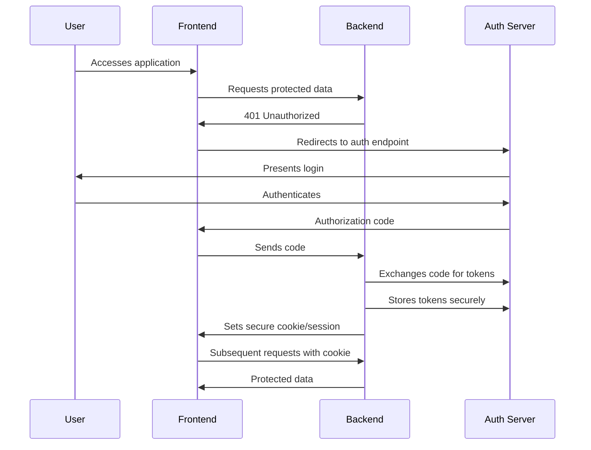

# BfFusion

**BfFusion** is a modern, secure full-stack prototype that demonstrates the Backend-for-Frontend (BFF) pattern using:

- **.NET 8 Web API** as the BFF and downstream services
- **React + Vite** frontend
- **OpenID Connect (OIDC)** authentication (e.g., Auth0, ME-ID, or other providers)
- **YARP** as a reverse proxy for routing frontend and downstream APIs

### Architecture Overview

                +--------------------------------+
                |      React/Angular Frontend    |
                +-----------+--------------------+
                                |
                                | (no tokens)
                                v
    +-------------------------+-------------------------------------+
    |            BFF (.NET 8 Web API)                               |
    |   - Serves React app (via YARP)                               |
    |   - Handles login/logout with OpenID Connect (ME-ID & Auth0)  |
    |   - Stores session using HttpOnly cookies                     |
    |   - Handles refresh token, token caching                      |
    |   - Hosts internal APIs                                       |
    |   - Calls external APIs (delegation via token)                |
    +-------------+-------------------------+-----------------------+
              |                         |
              | HTTP (access token)     | HTTP (access token)
              v                         v
     Internal API (.NET 8)          Downstream API (.NET 8)

### Solution Folder Structure

```
BFFusion.sln
├── BFFusion.Server/ # BFF .NET 8 Web API (auth, proxy, internal APIs)
├── BFFusion.DownstreamApi/  # Simulated downstream API, secured by OIDC
├── BFFusion.Spa.React/      # React frontend (Vite-powered SPA)
├── BFFusion.Spa.Angular/    # Angular frontend (Vite-powered SPA)
├── Directory.Build.props    # Shared .NET project settings
├── Directory.Packages.props # Centralized NuGet package versions
├── global.json # .NET SDK version pinning
├── README.md
├── .editorconfig # Consistent coding styles
```

### Tech Stack

| Layer        | Tech Used                        |
|--------------|----------------------------------|
| Frontend     | React 18 + Vite + TypeScript     |
| BFF          | ASP.NET Core 8 Web API + YARP    |
| Auth         | OpenID Connect (OIDC)            |
| Token Mgmt   | BFF, Cookie + Refresh            |
| Downstream   | .NET 8 Web API (JWT-secured)     |
| Proxy        | YARP Reverse Proxy               |

### Extensibility

1. Add more frontend frameworks: BFFusion.Spa.Angular, BFFusion.Spa.Vue
2. Add more downstream services: BFFusion.AnalyticsApi, etc.
3. Swap identity provider (Auth0, IdentityServer, Azure AD)
4. Dockerize for deployment (TODO)

### AuthN & AuthZ



### Remove Dependency on IdentityModel NuGet Package as It Is Deprecated (Duende.IdentityModel Is Not Free for Commercial Use)
This project includes a lightweight, custom implementation that:
1. Has no dependency on IdentityModel
2. Works with any OpenID Connect (OIDC) provider (e.g., Auth0, Azure AD)
3. Lightweight - designed to be minimal and framework-agnostic

Potential Improvements
1. Add retry logic for transient HTTP errors
2. Cache the discovery document (since it rarely changes).
3. Validate the issuer (iss claim) in the token response.

### TODO (Next Steps)

- Add unit and integration tests
- Docker support for local orchestration
- CI/CD setup

### License

This project is licensed with the [MIT license](LICENSE).

#### run from VS Code

How to Fix "Port is Already in Use" Issue

1. Run the following PowerShell command to find the process ID (PID) using the port (e.g. 7157)
```
netstat -ano | findstr 7157
```

2. kill the  process
```
taskkill /PID PID /F
```